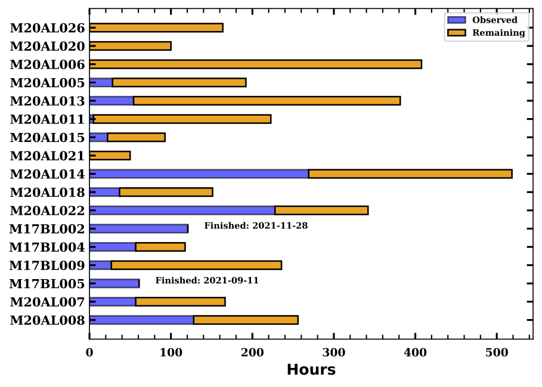
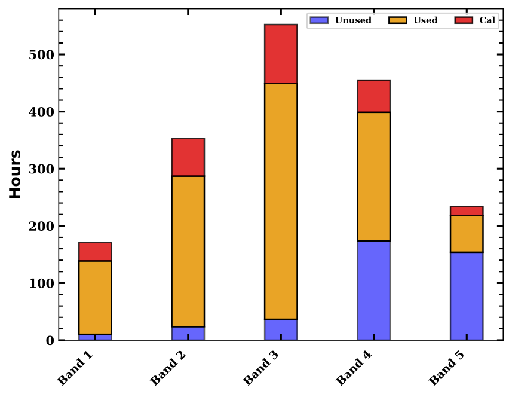

# LP_predict
Python script that simulates JCMT large program observing.

## General Description
The script combines the `astroplan` package, with the large program MSBs, and past WVM data, to create an observing schedule for each night allocated to large programs over the upcoming semester(s). Additional overheads such as, calibrations (equivalent to 25\% of the target observing time), time to slew between targets, blocked out dates for E\&C, and extended observing (occurs when we are in weather better than Band 3), are also included in the observing schedules to more closely match a real observing night at JCMT. 

The scheduler mimics the JCMT's flexible observing guidelines by stepping through the night sequentially, scheduling the highest priority MSBs that are observable. 
A target is only added to the target list for a night if it meets the following requirements: target has MSB repeats remaining, the night is not in the blackout dates for the instrument, the weather is appropriate for the MSB. 
Priority is set as follows: target is from the program for the current observing block (1), target has the same weather band as the night (2), target is allocated time for a worse weather band (3).

## Requires
* `astroplan`
* `numpy`
* `matplotlib`
* `astropy`
* `datetime`
* `pandas`

## To run the simulator script you need:

*  Start/End dates for simulation.
* Blocked out dates for each instrument (e.g., for E\&C).
* Large program details file (columns: project ID, priority, remaining hrs, allocated hrs, taumin, taumax).
* MSB files for each program (columns: project ID, msb id, remaining count, obs count, msb time (s), total msb hrs, instrument, type, polarization, target, ra (radians), dec (radians), taumin, taumax).
* Large program observing blocks file (columns: start date, end date, program with priority, optional second program with priority).

## Simulator output:

* Simulator results file: including allocated/observed/remaining hrs for each program, total observed hrs in simulation, total hrs lost to weather in simulation, program finish dates.
* File tabulating a breakdown of available, used, and unused hours in each weather band during the simulation.
* Schedules for each night in the simulation (tables and plots).

*  Simulator results plots: including program results bar chart (shown below), program completion chart (shown below), time breakdown bar chart (shown below), unused LST histograms per weather band (shown below), LST histograms per weather band for remaining MSBs.

