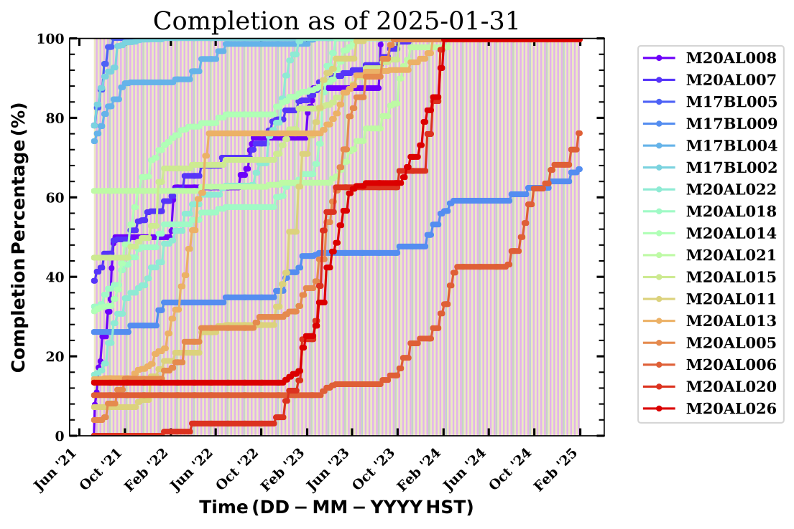
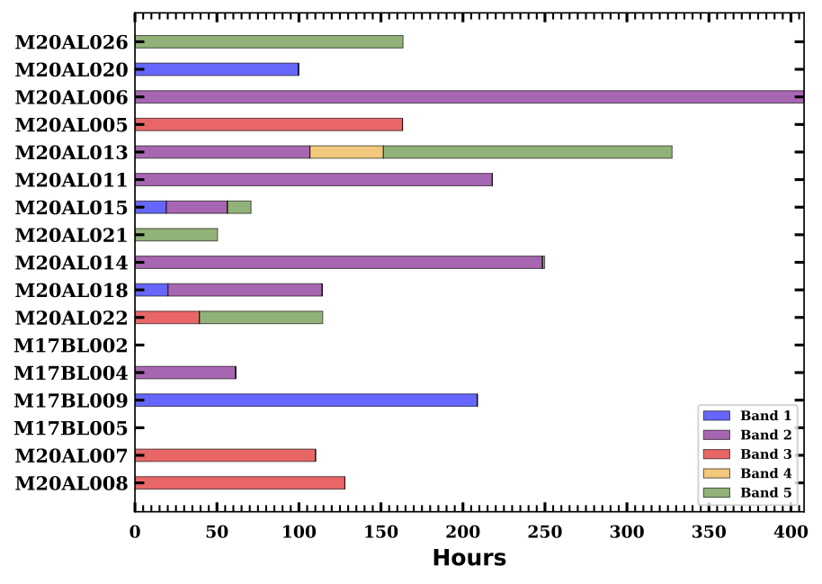

# LP_predict
Python script that simulates JCMT large program observing.

## General Description
The script combines the `astroplan` package, with the large program MSBs, and past WVM data, to create an observing schedule for each night allocated to large programs over the upcoming semester(s). Additional overheads such as, calibrations (equivalent to 25\% of the target observing time), time to slew between targets, faults (set rate of 3% per night), blocked out dates for E\&C, and extended observing (occurs when we are in weather better than Band 3), are also included in the observing schedules to more closely match a real observing night at JCMT. We model the JCMT schedule based on the average number of nights spent in the LAP, PI, UH, and DDT queues per semester.

The scheduler mimics the JCMT's flexible observing guidelines by stepping through the night sequentially, scheduling the highest priority MSBs that are observable. 
A target is only added to the target list for a night if it meets the following requirements: target has MSB repeats remaining, the night is not in the blackout dates for the instrument, the weather is appropriate for the MSB. 
Priority is set as follows: program rank (1), target has the same weather band as the night (2), target is allocated time for a worse weather band (3).

Script is compatible with both Python 2 and 3.

## Requires
* `astroplan`
* `numpy`
* `matplotlib`
* `astropy`
* `datetime`
* `pandas`
* `mysql-connector-python`

## To run the simulator script you need:

### On an EAO/JCMT computer: 

Usage: `lp_predict.py [-h] simstart simend scuba2_un harp_un rua_un dir`

* *simstart*: start of simulation -- `'yyyy-mm-dd'`

* *simend*: end of simulation -- `'yyyy-mm-dd'`

* *scuba2_un*: SCUBA-2 range of unavailable MJDs for E\&C -- `'MJD1,MJD2'`; if none enter `''`

* *harp_un*: HARP range of unavailable MJDs for E\&C -- `'MJD1,MJD2'`; if none enter `''`

* *rua_un*: UU/AWEOWEO range of unavailable MJDs for E\&C -- `'MJD1,MJD2'`; if none enter `''`

* *dir*: data directory (i.e., where script is stored) -- `'/path/to/dir/'`

Note: Place `lp_predict.py` and `getwvm.py` in *dir* before running above. You no longer need to input a JCMT schedule manually (LAP-UT-blocks-real-and-model-blocks.txt), the code now simulates the schedule for you (example_model_obs_blocks.txt). 

### On any machine, you will additionally need to generate: 

* Large program details file (1) and MSB files for each program (2; through running the sql scripts example-project-summary.sql and  example-project-info.sql on an EAO machine).
* WVM data file (through running the partner python script, getwvm.py, on an EAO machine).

To run the sql scripts on an EAO machine and save the query output to a file,

`ompsql < example-script.sql > output_file.txt`

To run the wvm script on an EAO machine, input the date range in the script, then,

`python wvm.py`

## Simulator output:

* Simulator results file: including allocated/observed/remaining hrs for each program, total observed hrs in simulation, total hrs lost to weather in simulation, program finish dates, program specific statistics (Transient - record of which months each target was observed, PITCH-BLACK - record of which semesters contained a campaign).
* File tabulating a breakdown of available, used, and unused hours in each weather band during the simulation.
* Files tabulating the remaining time in the large program queue after the simulation, split by weather band, instrument, and program.
* Schedules for each night in the simulation; table files and plots (shown below).

*  Simulator results plots: including program results bar chart (shown below), program completion chart (shown below), time breakdown bar chart (shown below), unused LST histograms per weather band (shown below), LST histograms per weather band for remaining MSBs, remaining hours split by weather band for each program (shown below), and remaining hours for all programs split by weather band and instrument (shown below).

